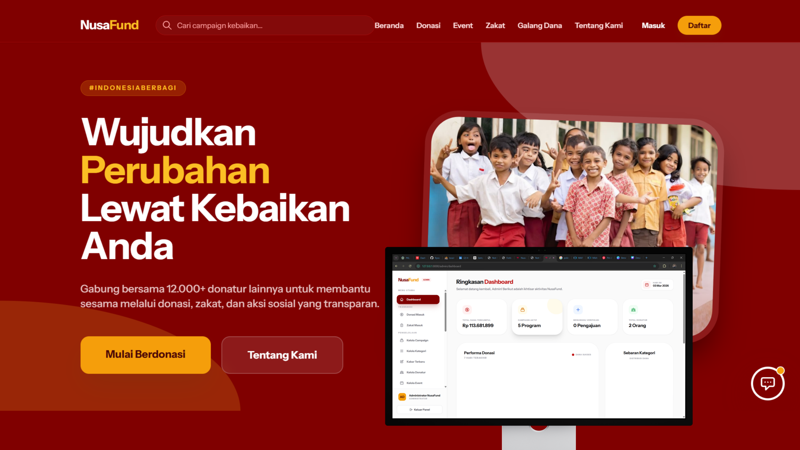

# NusaFund - Platform Filantropi Modern dan Transparan




NusaFund adalah platform penggalangan dana (fundraising), pengelolaan zakat, dan manajemen event kemanusiaan yang dibangun dengan fokus pada transparansi, otomatisasi pembayaran, dan pengalaman donatur yang premium.

## Fitur Utama

### 1. Manajemen Donasi dan Kampanye
- Sistem Kampanye: Pengelolaan penuh (CRUD) kampanye donasi dengan status aktif, selesai, atau ditangguhkan.
- Logika Target Tercapai: Sistem otomatis menutup akses donasi dan mengubah elemen visual jika target dana sudah terpenuhi 100 persen.
- Donasi Tanpa Login: Memungkinkan pengunjung berdonasi sebagai tamu (guest) untuk meningkatkan kenyamanan dan konversi.
- Doa dan Dukungan: Menampilkan pesan dukungan dan doa dari para donatur di setiap halaman detail kampanye.

### 2. Otomatisasi Pembayaran (Midtrans)
- Integrasi Midtrans Sandbox: Mendukung pembayaran otomatis melalui Virtual Account (khususnya Bank Syariah Indonesia).
- Pembaruan Status Otomatis: Saldo kampanye dan status transaksi diperbarui secara real-time melalui sistem callback Midtrans segera setelah pembayaran berhasil.

### 3. Ekosistem Donatur Smart AI
- Dashboard Donatur: Visualisasi data menggunakan Chart.js yang mencakup tren donasi bulanan dan sebaran dampak kategori.
- Sertifikat Digital Premium: Penerbitan piagam penghargaan otomatis dengan desain eksklusif yang dapat diunduh dalam format PDF.
- NusaBot (Gemini AI ChatBot): Asisten virtual pintar berbasis Google Gemini AI yang memahami konteks data campaign, FAQ, dan informasi organisasi secara real-time.

### 4. Transparansi dan Kredibilitas
- Kabar Terbaru (Updates): Ruang bagi administrator untuk melaporkan perkembangan penyaluran dana disertai dengan bukti dokumentasi foto.
- Sistem Event: Manajemen pendaftaran kegiatan sosial lengkap dengan sistem kontrol kuota peserta.
- Manajemen Zakat: Pengelolaan program zakat berdasarkan kategori asnaf dan koordinasi dengan lembaga penyalur terkait.
- FAQ dan Testimoni: Fasilitas edukasi publik dan ruang bukti sosial untuk menjaga kepercayaan masyarakat.

### 5. Optimasi dan SEO
- SEO Dashboard: Pengaturan metadata deskripsi dan kata kunci secara dinamis untuk setiap kampanye.
- Social Media Ready: Implementasi meta tags Open Graph untuk memastikan tampilan pratinjau yang rapi saat link dibagikan ke media sosial.
- Identitas Visual Dinamis: Pengelolaan logo dan informasi kontak terpusat melalui panel pengaturan administrator.

## Tech Stack
- Framework: Laravel 12
- Frontend: TailwindCSS, Alpine.js
- AI Engine: Google Gemini AI (v2.5 Flash)
- Database: MySQL
- Payment Gateway: Midtrans Snap API
- Visualisasi Data: Chart.js
- Ikon: Heroicons dan Lucide Icons

## Instalasi

1. Lakukan clone pada repositori ini.
2. Jalankan perintah `composer install` dan `npm install`.
3. Salin file `.env.example` menjadi `.env` dan sesuaikan konfigurasi database serta kredensial API:
   ```env
   GEMINI_API_KEY=your_gemini_key
   MIDTRANS_SERVER_KEY=your_server_key
   MIDTRANS_CLIENT_KEY=your_client_key
   MIDTRANS_IS_PRODUCTION=false
   ```
4. Jalankan migrasi database beserta seeder: `php artisan migrate --seed`.
5. Buat tautan penyimpanan: `php artisan storage:link`.
6. Jalankan server aplikasi: `php artisan serve` dan `npm run dev`.

## Responsivitas
Website ini telah dioptimasi sepenuhnya untuk perangkat mobile, termasuk fitur Sticky Mobile Donation Button yang dirancang untuk memudahkan proses donasi pada perangkat layar kecil.

---
Dikembangkan untuk mendukung kegiatan kemanusiaan dan pengelolaan dana sosial yang amanah.
